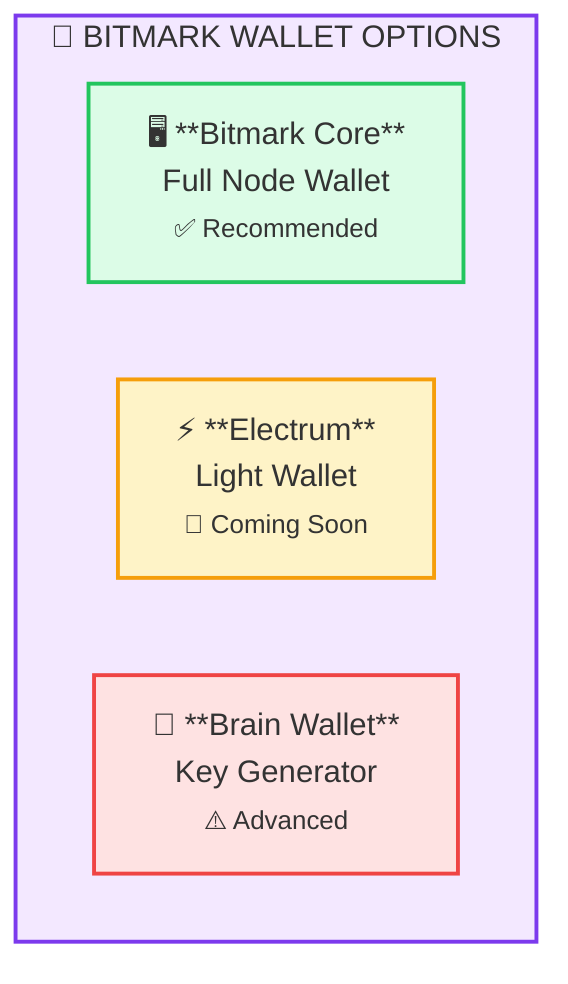
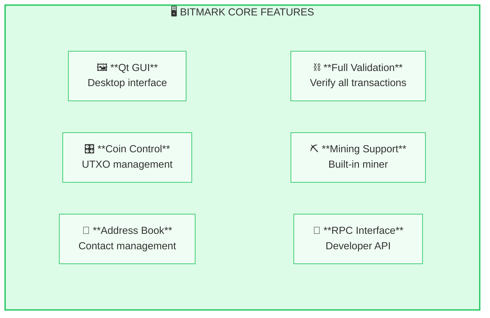
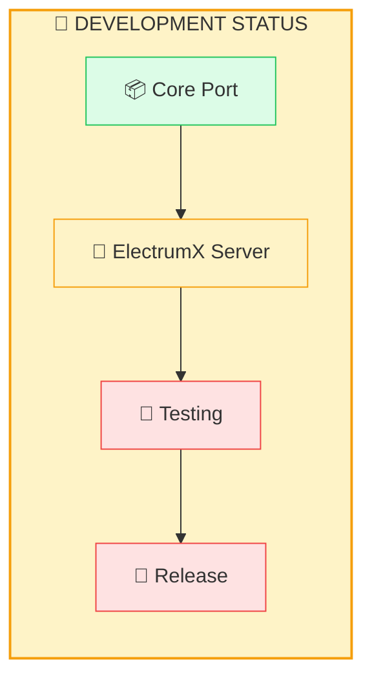
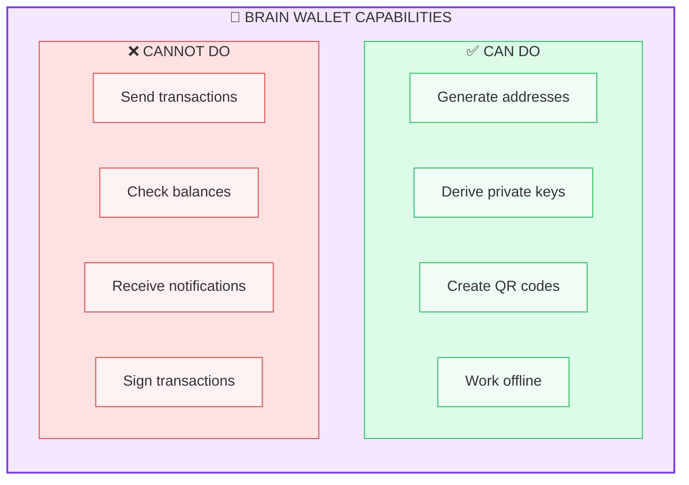
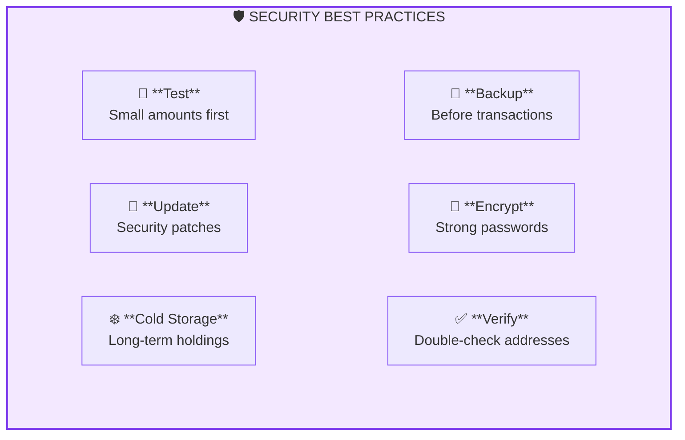

# Wallets

Multiple wallet options are available for storing and managing Bitmark.



## Wallet Comparison

| Wallet | Type | Status | Features |
|--------|------|--------|----------|
| Bitmark Core | Full Node | ✅ **Recommended** | Full validation, mining, sending/receiving |
| Electrum-Bitmark | Light Wallet | 🚧 **Coming Soon** | Fast sync, hardware wallet (WIP) |
| Brain Wallet | Key Generator | ⚠️ **Advanced Only** | Address generation only, no sending |

## Bitmark Core (Desktop)

:::tip Recommended
This is the recommended wallet for full network participation. It validates all transactions and supports mining.
:::

The official full-node wallet that downloads and validates the entire blockchain.



### Download

Get the latest release from [GitHub](https://github.com/project-bitmark/bitmark/releases).

**Current version**: v0.9.7.4

### System Requirements

| Component | Minimum | Recommended |
|-----------|---------|-------------|
| Storage | 5 GB | 10 GB |
| RAM | 2 GB | 4 GB |
| CPU | 2 cores | 4 cores |
| Network | Broadband | Broadband |

### Quick Start

```bash
# Download (Linux 64-bit example)
wget https://github.com/project-bitmark/bitmark/releases/latest/download/bitmark-linux64.tar.gz
tar -xzf bitmark-linux64.tar.gz

# Configure
mkdir -p ~/.bitmark
cat > ~/.bitmark/bitmark.conf << EOF
rpcuser=bitmarkrpc
rpcpassword=$(openssl rand -hex 32)
EOF

# Start GUI
./bitmark-qt

# Or start daemon
./bitmarkd -daemon
```

### Command Line

```bash
# Check balance
bitmark-cli getbalance

# Get new address
bitmark-cli getnewaddress

# Send coins
bitmark-cli sendtoaddress <address> <amount>

# List transactions
bitmark-cli listtransactions
```

## Electrum-Bitmark (Light Wallet)

:::info Work in Progress
The Electrum-Bitmark light wallet is currently under development. Check [GitHub](https://github.com/project-bitmark/electrum-bitmark) for progress and updates.
:::

A lightweight wallet that won't require downloading the full blockchain.



### Planned Features

- Fast synchronization (seconds, not hours)
- Hardware wallet support (Trezor, Ledger)
- Multi-signature support
- Cold storage
- Portable (no blockchain download)
- Watch-only wallets

### Repository

Follow development: [GitHub](https://github.com/project-bitmark/electrum-bitmark)

## Brain Wallet (Key Generation Tool)

:::caution Not a Full Wallet
This is a **key/address generation utility only**. It cannot send transactions, check balances, or interact with the blockchain. Use the Desktop Wallet for full functionality.
:::

A web-based tool for generating Bitmark addresses and private keys from a passphrase.

**URL**: [project-bitmark.github.io/brain](https://project-bitmark.github.io/brain/)



### Use Cases

This tool is useful for:
- Generating receive addresses offline
- Deriving keys from a memorable passphrase
- Creating paper wallet addresses
- Advanced users who manage keys separately

### Security Warning

:::warning Strong Passphrase Required
Brain wallets derive keys from your passphrase. Weak passphrases can be cracked! Use only with very strong, unique passphrases (20+ characters with numbers and symbols).
:::

### Best Practices

1. Use a long, unique passphrase (20+ characters)
2. Include numbers and special characters
3. Never use dictionary words or common phrases
4. Store the passphrase securely (password manager)
5. Test recovery before depositing funds
6. **Use Desktop Wallet to actually send/receive funds**

## Paper Wallet

Generate offline paper wallets for cold storage.

**Repository**: [project-bitmark/paper-wallet](https://github.com/project-bitmark/paper-wallet)

### Features

- Generate offline
- Print and store securely
- BIP38 encryption option
- Tamper-evident design

### Best Practices

1. Generate on an air-gapped computer
2. Print on a non-networked printer
3. Store in multiple secure locations
4. Consider BIP38 encryption
5. Laminate to protect from damage

## Wallet Backup

### Core Wallet

```bash
# Backup wallet file
cp ~/.bitmark/wallet.dat ~/backup/wallet.dat.backup

# Or via RPC
bitmark-cli backupwallet /path/to/backup.dat
```

### Electrum Wallet

1. **Seed phrase**: Write down and store securely
2. **Wallet file**: `~/.electrum-bitmark/wallets/`

### Recovery

**From seed phrase**:
- Electrum: File → New/Restore → Standard wallet → I have a seed

**From wallet.dat**:
- Replace `~/.bitmark/wallet.dat` with backup
- Restart wallet

## Address Types

| Type | Prefix | Example |
|------|--------|---------|
| Mainnet P2PKH | `b` | `bKxE7vRhRPMs...` |
| Testnet P2PKH | `u` | `uJk3FpRmNxQs...` |

## Security Tips



## Troubleshooting

### "Wallet locked"

```bash
# Unlock for sending
bitmark-cli walletpassphrase <passphrase> 60
```

### "Not enough funds"

Check:
- Confirmed balance vs. total balance
- Transaction fees included
- Unconfirmed inputs

### Sync issues

```bash
# Rescan blockchain
bitmark-cli rescanblockchain

# Or restart with -rescan
bitmarkd -rescan
```

## See Also

- [Quick Start Guide](/getting-started/quick-start)
- [Wallet Setup Guide](/guides/wallet-setup)
- [Security Best Practices](/guides/security)
