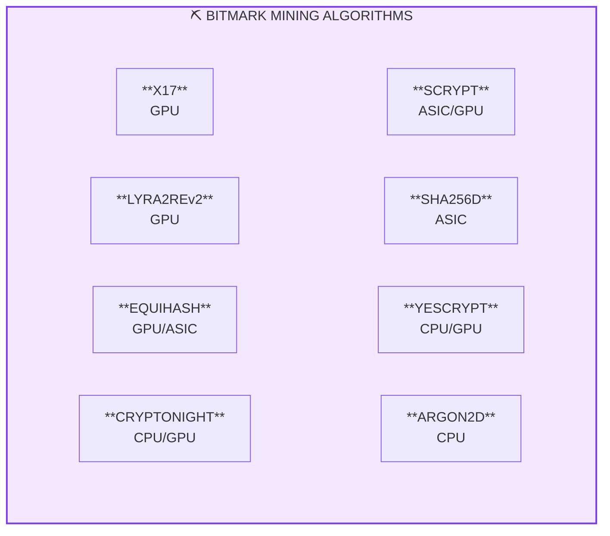
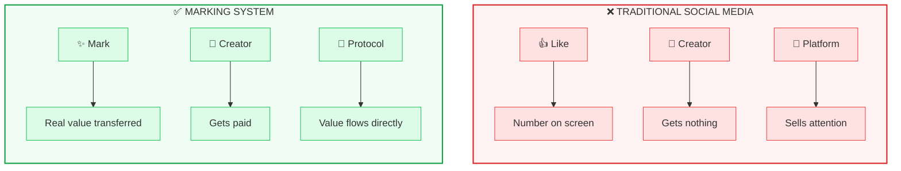
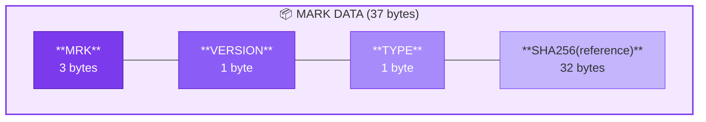
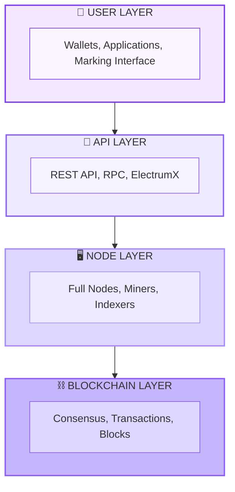

# Core Concepts

This page explains the fundamental concepts behind Bitmark.

## Blockchain Basics

### Blocks

Bitmark uses a blockchain, a chain of cryptographically linked blocks containing transactions. Each block:

- Contains a set of verified transactions
- Links to the previous block via its hash
- Is secured by proof-of-work

**Block Time**: Bitmark targets a **2-minute** average block time, providing faster confirmations than Bitcoin (10 min) while maintaining network stability.

### Transactions

Transactions move MARKS between addresses. Each transaction:

- Has inputs (source of funds)
- Has outputs (destination of funds)
- Is signed with the sender's private key
- Pays a small fee to miners

### Addresses

Bitmark addresses are Base58-encoded identifiers:

- **Mainnet**: Start with `b` (prefix 85)
- **Testnet**: Start with `u` (prefix 130)

Example: `bKxE7vRhRPMsda...`

## Multi-Algorithm Proof of Work

Unlike most cryptocurrencies that use a single mining algorithm, Bitmark supports **eight algorithms** simultaneously.

### Why Multi-Algo?

1. **Decentralization**: Different hardware types can participate
2. **Security**: Attackers must control majority of ALL algorithms
3. **Accessibility**: CPU, GPU, and ASIC miners all welcome
4. **Resilience**: If one algorithm is compromised, others continue

### The Eight Algorithms

Each algorithm:
- Has independent difficulty adjustment
- Targets 16-minute intervals (8 algos × 16 min ÷ 8 = 2 min average)
- Contributes 1/8 of the total coin emission

## Difficulty Adjustment

Bitmark uses **Dark Gravity Wave v3 (DGWv3)** for difficulty adjustment, customized for multi-algorithm use.

### Key Features

- **Per-Block Adjustment**: Difficulty adjusts every block for each algorithm
- **25-Block Window**: Looks at last 25 blocks of the same algorithm
- **Responsive**: Quickly adapts to hashrate changes

### Special Mechanisms

**Surge Protector**: Prevents mining dominance
- Triggers after 9 consecutive blocks from same algorithm
- Divides difficulty by 3
- Discourages burst mining

**Resurrector**: Keeps algorithms viable
- Triggers if algorithm halts for >160 minutes
- Reduces difficulty proportionally
- Prevents algorithm abandonment

## Monetary Policy

### Supply

| Parameter | Value |
|-----------|-------|
| Maximum Supply | ~27,579,894 MARKS |
| Initial Block Reward | 20 MARKS |
| Current Distribution | Multi-algorithm (1/8 each) |

### Emission Schedule

The emission uses a combined **halving + quartering** pattern:

```mermaid
flowchart LR
    R20["**20**<br/>MARKS"] -->|"Q1<br/>×0.75"| R15["**15**<br/>MARKS"]
    R15 -->|"H1<br/>÷2"| R10["**10**<br/>MARKS"]
    R10 -->|"Q2<br/>×0.75"| R75["**7.5**<br/>MARKS"]
    R75 -->|"H2<br/>÷2"| R5["**5**<br/>MARKS"]
    R5 -->|"Q3<br/>×0.75"| R375["**3.75**<br/>MARKS"]
    R375 -->|"H3<br/>÷2"| R25["**2.5**<br/>MARKS"]
    R25 -->|"..."| Future["..."]

    style R20 fill:#7c3aed,stroke:#5b21b6,color:#fff
    style R15 fill:#8b5cf6,stroke:#6d28d9,color:#fff
    style R10 fill:#a78bfa,stroke:#7c3aed,color:#fff
    style R75 fill:#c4b5fd,stroke:#8b5cf6
    style R5 fill:#ddd6fe,stroke:#a78bfa
    style R375 fill:#ede9fe,stroke:#c4b5fd
    style R25 fill:#f5f3ff,stroke:#ddd6fe
    style Future fill:#faf5ff,stroke:#ede9fe
```

Where:
- **H** = Halving (reward / 2)
- **Q** = Quartering (reward × 0.75)

This creates a smoother emission curve than simple halving.

### Scaling Factors

A **Subsidy Scaling Factor (SSF)** adjusts rewards based on network hashrate:
- Prevents hashrate spikes from accelerating emission
- Maintains predictable monetary policy
- Updates approximately every 24 hours

## The Marking System

**Marking** is Bitmark's unique reputation + currency system.

### Core Idea

A mark is a "like" that carries real economic value:

### How Marks Work

1. You see valuable content
2. You "mark" it (one click)
3. A small amount of MARKS transfers to the creator
4. Your reputation as a curator grows
5. Their reputation as a creator grows

### MRK Protocol

Marks are recorded on-chain using **OP_RETURN** transactions:

Mark types include:
- URL marks (web content)
- Address marks (creator attribution)
- Nostr profile marks
- Git commit marks
- Document proofs

Learn more: [MRK Protocol](/marking/mrk-protocol)

## Units of Currency

| Unit | Symbol | Value |
|------|--------|-------|
| Bitmark | BTM | 1.0 |
| Mark | ₥ | 0.001 BTM |
| Markbit | MB | 0.00000001 BTM |

The smallest divisible unit is **1 satoshi** = 0.00000001 BTM = 1 Markbit.

## Network Architecture

## Key Terminology

| Term | Definition |
|------|------------|
| **Block** | Container of transactions, linked in a chain |
| **Transaction** | Transfer of value between addresses |
| **Mark** | A like with economic value |
| **Algorithm** | Hash function used for proof-of-work |
| **Difficulty** | Measure of mining computational effort |
| **UTXO** | Unspent Transaction Output - spendable coins |
| **DGWv3** | Dark Gravity Wave v3 difficulty algorithm |
| **AuxPow** | Auxiliary Proof-of-Work (merge mining) |

## Next Steps

- [The Marking Vision](/marking/vision) - Deep dive into the marking system
- [Technical Overview](/technical/overview) - Technical specifications
- [Mining Guide](/ecosystem/mining) - Start mining Bitmark
