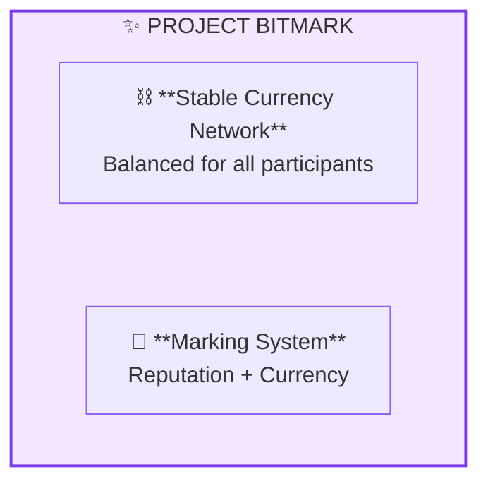
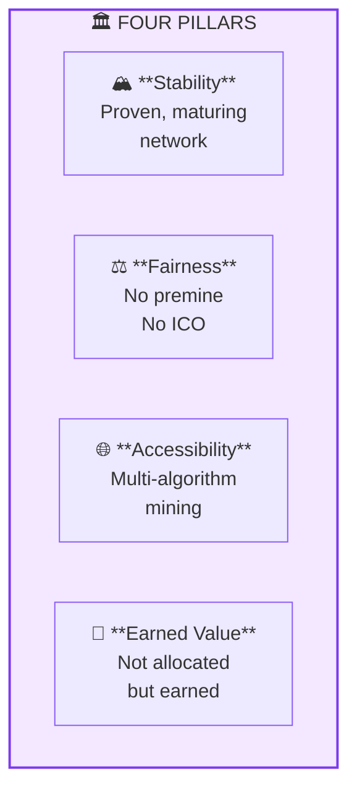
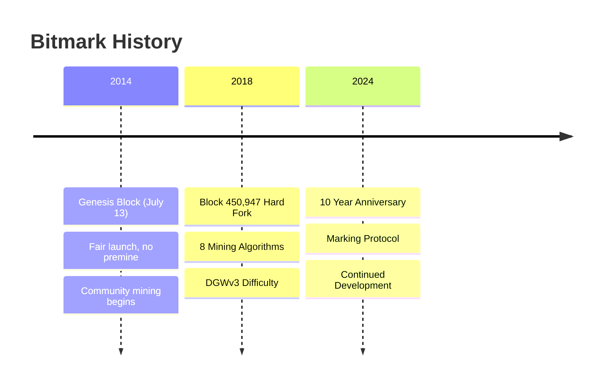
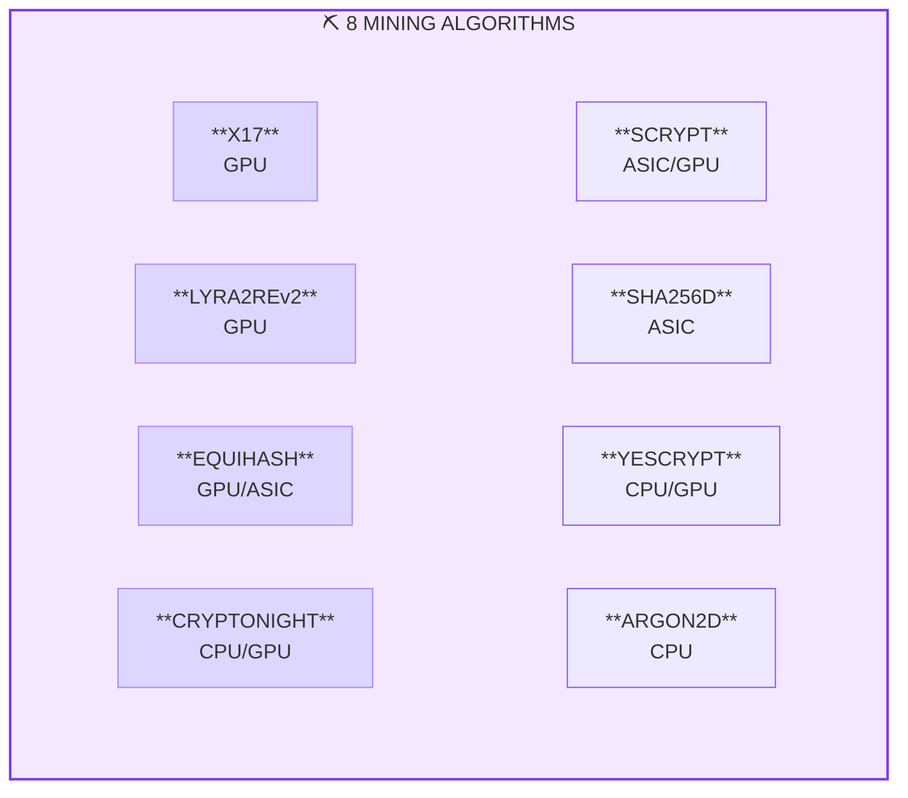
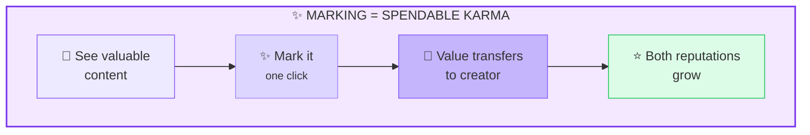
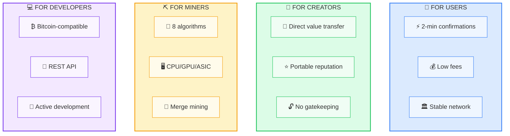
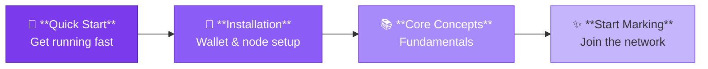

# Introduction to Bitmark

Project Bitmark is a multi-faceted project that provides:

1. **A stable cryptographic currency network** which balances the requirements of all parties involved
2. **A far-reaching adoption initiative** guided by the vision of a novel reputation + currency system called **Marking**

## What is Bitmark?

Bitmark is a cryptocurrency that has been operational since **July 2014**. It was designed with a focus on:

## The Genesis

> "13/July/2014, with memory of the past, we look to the future. TDR"
>
> — Bitmark Genesis Block

Bitmark was launched with a genuine fair launch approach, ensuring that all coins were distributed through proof-of-work mining. There was no premine or token sale.

## Key Features

### Multi-Algorithm Proof of Work

Since the 2018 hard fork at block 450,947, Bitmark supports **eight distinct mining algorithms**:

This diversity ensures that mining remains accessible to different types of hardware.

### The Marking System

The **Marking** system is Bitmark's unique reputation + currency mechanism. Think of it as "likes that carry real value":

- When you **mark** content, you transfer actual currency to the creator
- Your reputation as a curator grows with good marks
- Quality content rises based on economic signals, not algorithms
- Spam becomes economically expensive

Learn more in [The Marking Vision](/marking/vision).

### Network Parameters

| Parameter | Value |
|-----------|-------|
| Block Time | 2 minutes |
| Max Supply | ~27.58 million MARKS |
| Difficulty Adjustment | Dark Gravity Wave v3 |
| Consensus | Multi-Algorithm PoW |

## Why Bitmark?

## Getting Started

Ready to dive in? Here's where to go next:

- [Quick Start Guide](/getting-started/quick-start) - Get up and running fast
- [Installation](/getting-started/installation) - Set up wallet and node
- [Core Concepts](/getting-started/core-concepts) - Understand the fundamentals

## Community

Join the Bitmark community:

- [GitHub](https://github.com/project-bitmark) - Source code and development
- [Reddit](https://reddit.com/r/Bitmark) - Community discussions
- [BitcoinTalk](https://bitcointalk.org/index.php?topic=660544.0) - Original announcement thread

## Project Repositories

The main repositories in the Project Bitmark ecosystem:

| Repository | Description |
|------------|-------------|
| [bitmark](https://github.com/project-bitmark/bitmark) | Core node software |
| [bitmark-api](https://github.com/project-bitmark/bitmark-api) | REST API and indexer |
| [marked](https://github.com/project-bitmark/marked) | Social marking application |
| [electrum-bitmark](https://github.com/project-bitmark/electrum-bitmark) | Light wallet |
| [BIP](https://github.com/project-bitmark/BIP) | Bitmark Improvement Proposals |
