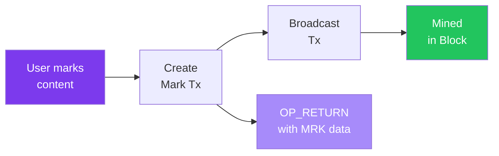

# How Marking Works

This page explains the technical mechanics of the Marking system.

## The Basic Flow



## Mark Transaction Structure

A mark is recorded as a special Bitcoin-style transaction with an `OP_RETURN` output containing mark data.

### Transaction Inputs

```
Inputs:
  - UTXO(s) from marker's wallet
    (funds the mark amount + transaction fee)
```

### Transaction Outputs

```
Outputs:
  1. OP_RETURN with mark data  (0 satoshis)
  2. Optional: Payment to marked address
  3. Change back to marker
```

### Mark Data Format

The OP_RETURN contains exactly **37 bytes** of mark data:

```
┌─────────┬─────────┬─────────┬───────────────────────────────┐
│   MRK   │ VERSION │  TYPE   │     SHA256(reference)         │
│ 3 bytes │ 1 byte  │ 1 byte  │         32 bytes              │
└─────────┴─────────┴─────────┴───────────────────────────────┘
```

| Field | Bytes | Value | Description |
|-------|-------|-------|-------------|
| Magic | 0-2 | `0x4D524B` | "MRK" in ASCII |
| Version | 3 | `0x01` | Protocol version |
| Type | 4 | `0x01-0x09` | What is being marked |
| Reference | 5-36 | 32 bytes | SHA256 of the reference |

## Mark Types

Different types of content can be marked:

| Code | Type | Reference Format | Use Case |
|------|------|------------------|----------|
| `0x01` | URL | SHA256(URL string) | Web content, articles |
| `0x02` | Address | SHA256(address string) | Creator attribution, tips |
| `0x03` | Content | SHA256(content hash) | IPFS CIDs, file hashes |
| `0x04` | Nostr Profile | Raw 32-byte pubkey | Mark a Nostr user |
| `0x05` | Git Commit | SHA256(commit string) | Mark code contributions |
| `0x06` | Document | SHA256(file bytes) | Proof of existence |
| `0x07` | Timestamp | SHA256(file bytes) | Cross-chain timestamping |
| `0x08` | Nostr Event | Raw 32-byte event id | Mark specific notes |
| `0x09` | URI | SHA256(URI string) | Linked data identifiers |

## Creating a Mark

### Step 1: Prepare Reference

Compute the reference hash based on mark type:

```javascript
// For URL mark
const reference = "https://example.com/great-article";
const referenceHash = SHA256(UTF8_ENCODE(reference));

// For Nostr profile (already 32 bytes)
const referenceHash = hexDecode(nostrPubkey);
```

### Step 2: Build Mark Data

```javascript
const markData = Buffer.concat([
  Buffer.from('MRK'),           // Magic (3 bytes)
  Buffer.from([0x01]),          // Version (1 byte)
  Buffer.from([0x01]),          // Type: URL (1 byte)
  referenceHash                  // SHA256 hash (32 bytes)
]);
// Total: 37 bytes
```

### Step 3: Create Transaction

```javascript
const tx = {
  inputs: [
    { txid: utxo.txid, vout: utxo.vout }
  ],
  outputs: [
    { value: 0, script: OP_RETURN + PUSH(37) + markData },
    { value: inputValue - markAmount - fee, script: changeAddress }
  ]
};
```

### Step 4: Sign and Broadcast

```javascript
const signedTx = sign(tx, privateKey);
await broadcast(signedTx);
```

## Mark Weight (Value)

The transaction fee serves as the "mark weight" - a measure of commitment:

- **Higher fee** = Stronger endorsement
- **Recommended minimum**: 0.01 BTM
- Fees go to miners, supporting network security

## Reference Storage

Since only the hash is stored on-chain, the original reference should be stored off-chain.

### Off-Chain Storage Options

1. **Nostr Relays**: Store as Nostr events with mark references
2. **IPFS**: Content-addressed storage
3. **Centralized API**: The bitmark-api provides reference storage

### API Endpoints

```bash
# Store a reference
POST /reference
{
  "reference": "https://example.com/article",
  "hash": "8823a419..."
}

# Retrieve reference by hash
GET /reference/8823a419...
```

## Verification

To verify a mark:

```javascript
function verifyMark(opReturnData, knownReference) {
  // 1. Check magic bytes
  if (opReturnData.slice(0, 3) !== 'MRK') return false;

  // 2. Extract fields
  const version = opReturnData[3];
  const type = opReturnData[4];
  const storedHash = opReturnData.slice(5, 37);

  // 3. Verify hash matches reference
  const computedHash = SHA256(UTF8_ENCODE(knownReference));
  return storedHash === computedHash;
}
```

## Mark Discovery

### Finding Marks in Blocks

Scan transactions for OP_RETURN outputs starting with "MRK":

```javascript
for (const tx of block.transactions) {
  for (const output of tx.outputs) {
    if (output.script.startsWith('6a254d524b')) {
      // OP_RETURN (6a) + PUSH 37 (25) + "MRK" (4d524b)
      const mark = parseMark(output.script);
      console.log('Found mark:', mark);
    }
  }
}
```

### Indexing Marks

The bitmark-api maintains an index of all marks:

```sql
CREATE TABLE marks (
  txid TEXT PRIMARY KEY,
  block_height INTEGER,
  version INTEGER,
  type INTEGER,
  reference_hash TEXT,
  fee INTEGER,
  timestamp INTEGER
);
```

Query marks:
```bash
# Get marks by reference hash
GET /api/marks?hash=8823a419...

# Get marks by type
GET /api/marks?type=1

# Get recent marks
GET /api/marks?limit=100
```

## Mark Aggregation

Reputation is computed by aggregating marks:

```javascript
function computeReputation(address) {
  const marksReceived = getMarksTo(address);
  return {
    totalMarks: marksReceived.length,
    totalValue: sum(marksReceived.map(m => m.fee)),
    uniqueMarkers: unique(marksReceived.map(m => m.from)).length
  };
}
```

## Leaderboards

Marks enable transparent, verifiable leaderboards:

```
┌─────────────────────────────────────────────────────────┐
│  CREATOR LEADERBOARD                      [24h | 7d]   │
├─────────────────────────────────────────────────────────┤
│  #1  alice@example     Marks: 1,847   Value: 23.5 BTM  │
│  #2  bob@example       Marks: 1,234   Value: 18.2 BTM  │
│  #3  carol@example     Marks: 892     Value: 12.1 BTM  │
└─────────────────────────────────────────────────────────┘
```

## Integration with Nostr

For off-chain mark metadata, Nostr provides:

1. **Profile Linking**: Associate Bitmark addresses with Nostr identities
2. **Event Storage**: Store mark context and descriptions
3. **Relay Infrastructure**: Distributed storage for mark references
4. **Real-time Updates**: Subscribe to new marks

### Nostr Event for Mark Context

```json
{
  "kind": 30078,
  "content": "Great article on cryptocurrency economics!",
  "tags": [
    ["d", "mark-context"],
    ["mark-txid", "abc123..."],
    ["reference", "https://example.com/article"],
    ["p", "<creator-pubkey>"]
  ]
}
```

## Best Practices

### For Markers

1. **Verify before marking**: Ensure the reference resolves to real content
2. **Use appropriate amounts**: Match mark value to content value
3. **Store references**: Keep copies of what you marked

### For Content Creators

1. **Provide clear addresses**: Make it easy to receive marks
2. **Link your identity**: Connect Bitmark address to your profile
3. **Acknowledge marks**: Build community by recognizing supporters

### For Developers

1. **Index marks**: Build searchable mark databases
2. **Validate thoroughly**: Check all mark fields
3. **Cache references**: Don't rely solely on on-chain data
