# Marking Use Cases

The Marking system enables a wide range of applications beyond simple "likes with value."

## Content Monetization

### Articles and Blog Posts

Writers can receive direct payment for valuable content:

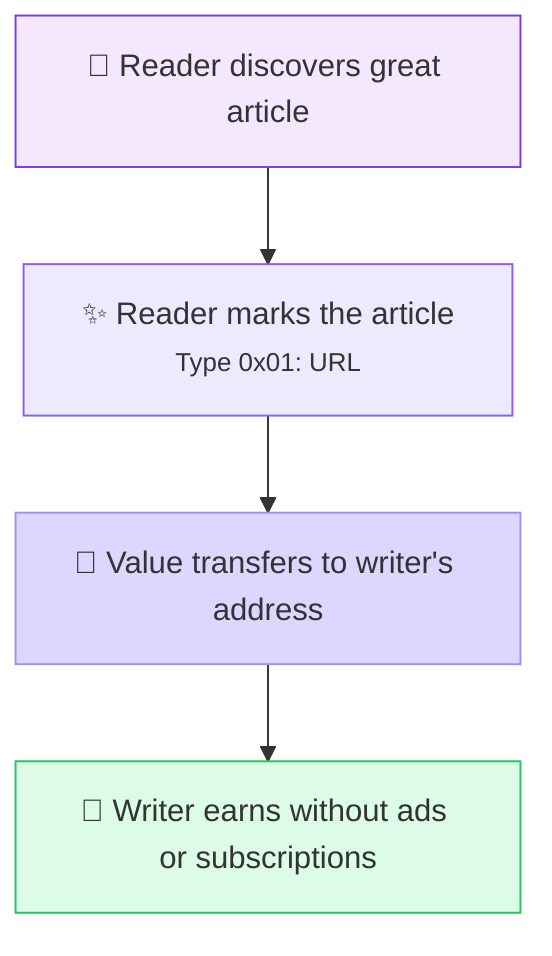

**Benefits:**
- No paywall friction
- Readers pay what they feel content is worth
- Writers maintain creative independence
- No platform taking 30-50% cut

### Music and Art

Artists can monetize individual works:

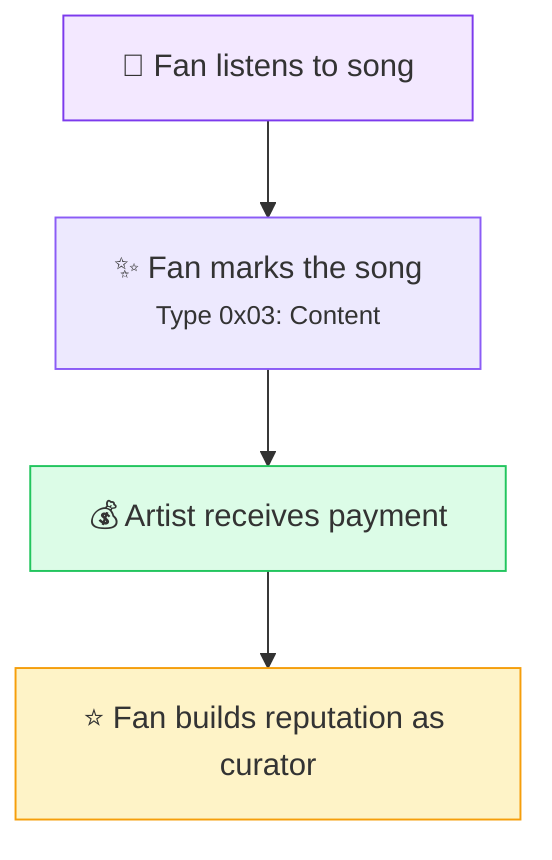

### Video Content

Complement or replace ad-based revenue:

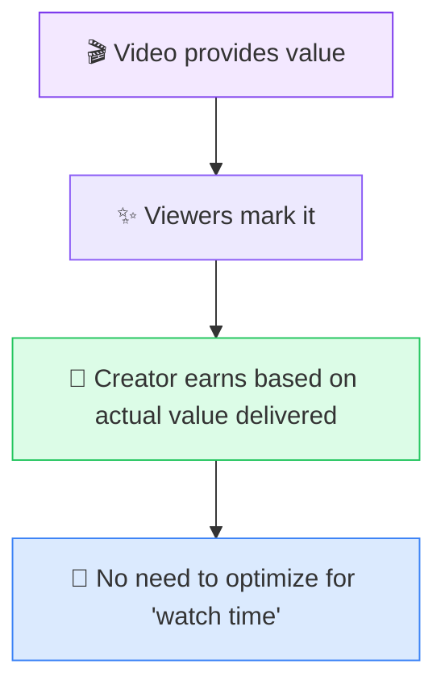

## Proof of Existence

### Document Timestamping

Prove a document existed at a specific time:

```javascript
// Create document mark
const docHash = SHA256(readFile('contract.pdf'));
const mark = createMark(0x06, docHash);  // Type: Document

// Later, prove existence
const blockTime = getBlockTimestamp(mark.txid);
console.log(`Document proven to exist before ${blockTime}`);
```

**Use cases:**
- Prior art claims
- Contract signing timestamps
- Research publication dates
- Legal evidence

### Cross-Chain Timestamping

Use Type 0x07 for OpenTimestamps-compatible proofs:

```javascript
// Same hash can be timestamped on both Bitcoin (via OTS) and Bitmark
const fileHash = SHA256(readFile('important.pdf'));

// Timestamp on Bitmark (faster, cheaper)
createMark(0x07, fileHash);

// Also timestamp on Bitcoin (via OpenTimestamps)
otsTimestamp(fileHash);

// Now you have dual-chain proof of existence
```

## Git Integration

### Code Contribution Attribution

Mark git commits to recognize developers:

```bash
# Mark a valuable commit
bitmark-cli mark git 7f8d9e2...

# The commit is now timestamped and attributed
```

**Benefits:**
- Provable contribution history
- Developer reputation building
- Open source contributor recognition

### Repository Endorsement

Mark repositories you find valuable:

```javascript
createMark(0x05, "https://github.com/project-bitmark/bitmark");
```

This creates a transparent, on-chain record of which projects the community values.

## Social Network Integration

### Nostr Integration

Mark Nostr profiles and events:

```javascript
// Mark a helpful Nostr user
createMark(0x04, nostrPubkey);  // Type: Nostr Profile

// Mark a valuable note
createMark(0x08, eventId);  // Type: Nostr Event
```

**Benefits:**
- Cross-platform reputation
- No platform can remove your marks
- Portable social proof

### Web of Trust

Build trust networks through marking patterns:

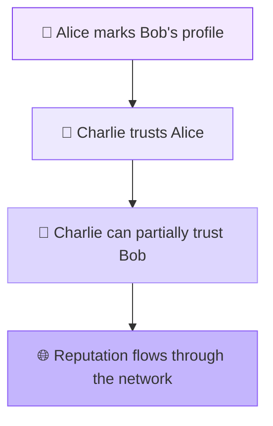

## Infrastructure Marketplace

### Paying for Services

Infrastructure operators can charge marks for services:

```yaml
# Explorer operator config
pricing:
  query: 0.0001 marks
  bulk_query: 0.00001 marks (per result)
  historical: 0.001 marks (older than 1 year)

free_tier:
  queries_per_day: 100
  reason: "Build reputation"
```

### Quality Competition

Operators compete on quality and reputation:

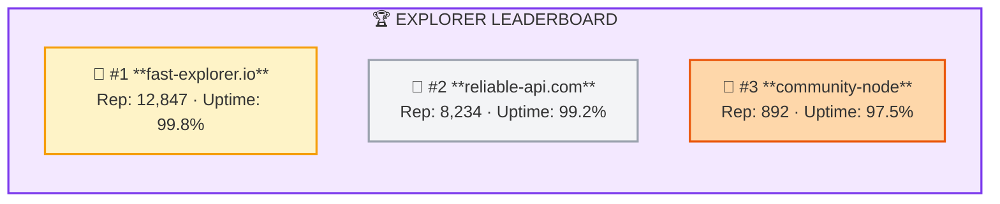

## Spam Prevention

### Stake-Based Posting

Require marks to post, returned if content is valuable:

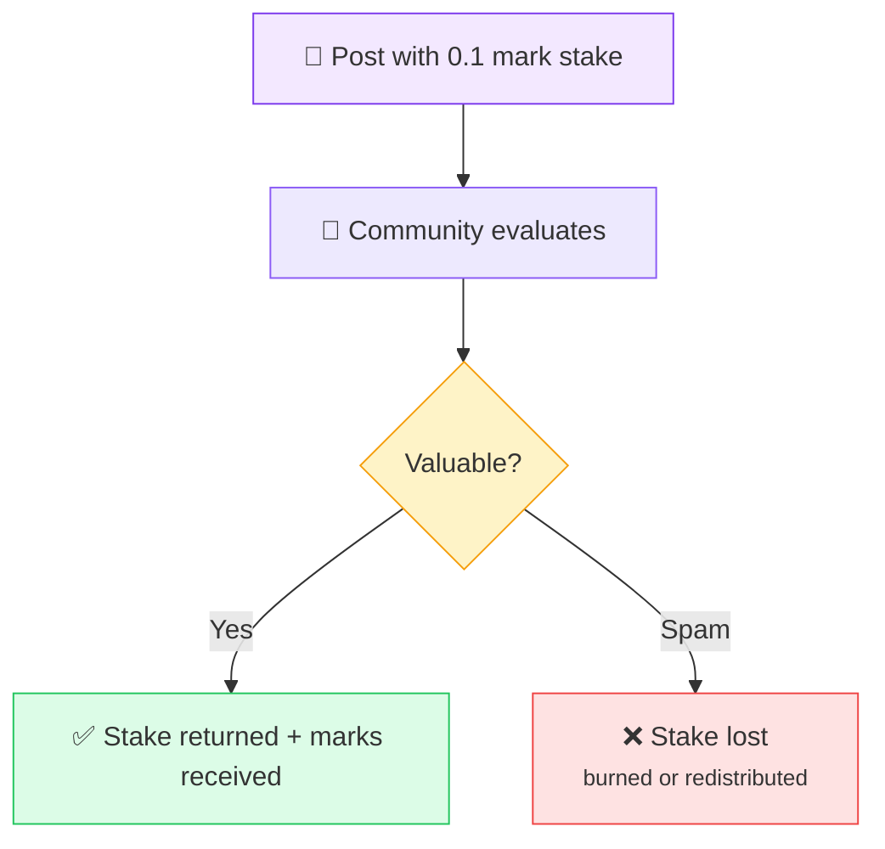

### Economic Filtering

High-value content rises naturally:

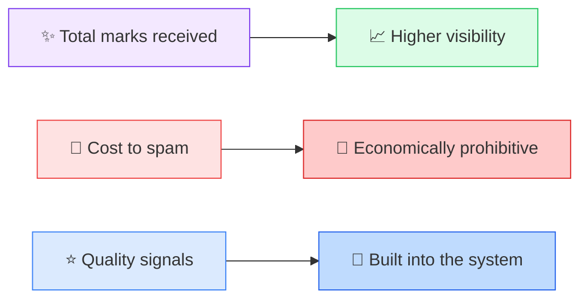

## Charity and Public Goods

### Automatic Allocation

Configure wallets to donate portion of marks:

```yaml
wallet_config:
  charity_address: "bCharityAddress..."
  allocation: 1%  # 1% of received marks

  causes:
    - environment: 40%
    - education: 30%
    - healthcare: 30%
```

### Transparent Giving

All donations are on-chain and verifiable:

```javascript
// Anyone can verify charity funding
const charityMarks = getMarksTo(charityAddress);
console.log(`Total donated: ${sum(charityMarks)} BTM`);
```

## Creator Economy Features

### Referral Credits

Earn marks for sharing quality content:

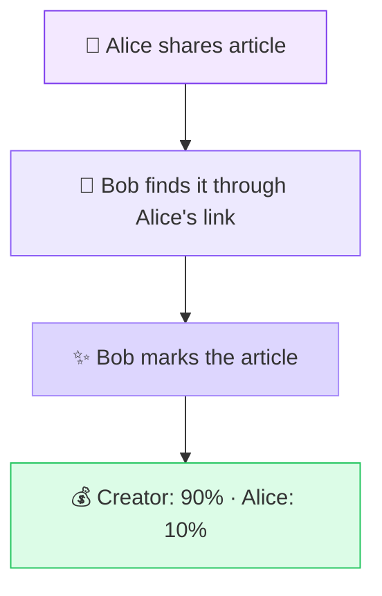

### Tiered Recognition

Different mark amounts for different recognition levels:

| Mark Amount | Recognition |
|-------------|-------------|
| 0.001-0.01 | Appreciation |
| 0.01-0.1 | Support |
| 0.1-1.0 | Patron |
| 1.0+ | Sponsor |

## Enterprise Applications

### Internal Knowledge Attribution

Companies can use marking for internal knowledge sharing:

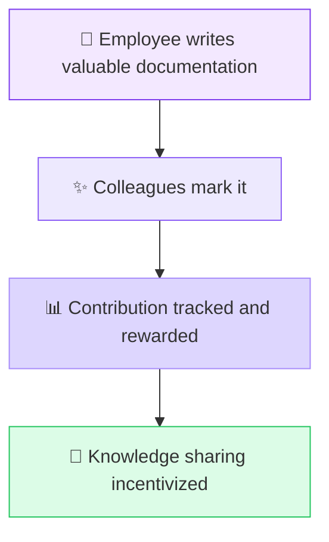

### Customer Feedback

Products and services can be marked:

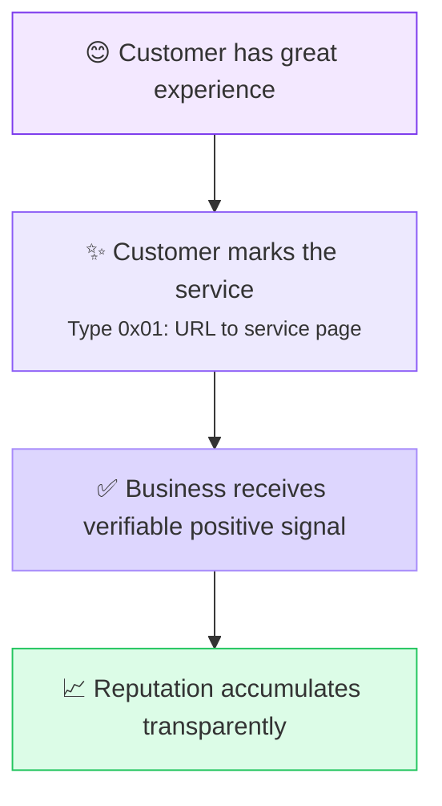

## Research Applications

### Academic Citation Alternative

Mark research papers as a form of citation:

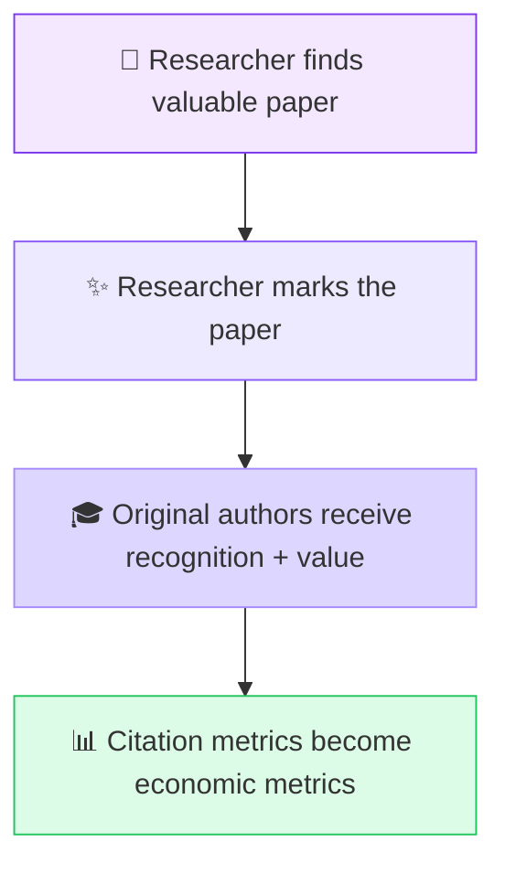

### Open Science Funding

Fund research directly through marks:

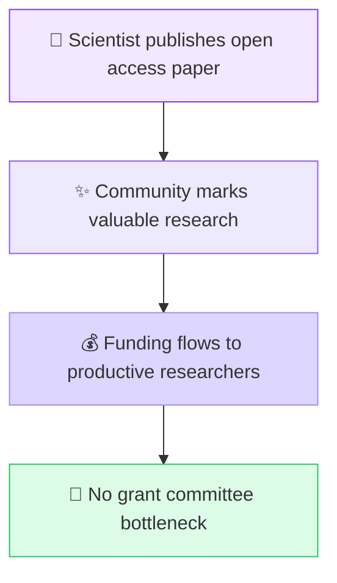

## Implementation Examples

### Basic Marking Flow

```javascript
const bitmarkApi = require('bitmark-api');

async function markContent(url, amount) {
  // 1. Hash the reference
  const hash = crypto.SHA256(url);

  // 2. Create mark transaction
  const mark = await bitmarkApi.createMark({
    type: 0x01,  // URL
    referenceHash: hash,
    fee: amount
  });

  // 3. Store reference for lookup
  await bitmarkApi.storeReference(url, hash);

  // 4. Broadcast transaction
  const txid = await bitmarkApi.broadcast(mark);

  return { txid, hash };
}
```

### Querying Marks

```javascript
// Get all marks for a URL
const url = "https://example.com/article";
const hash = crypto.SHA256(url);
const marks = await bitmarkApi.getMarks({ hash });

console.log(`Total marks: ${marks.length}`);
console.log(`Total value: ${marks.reduce((a, m) => a + m.fee, 0)} BTM`);
```

## Getting Started

Ready to implement marking in your application?

1. [Set up bitmark-api](/ecosystem/api)
2. [Create your first mark](/guides/creating-marks)
3. [Integrate with your platform](/reference/rest-api)
