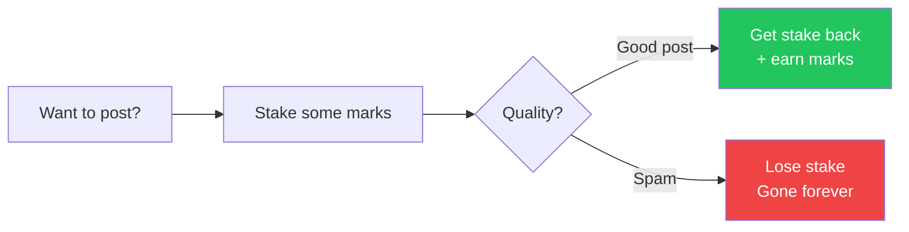
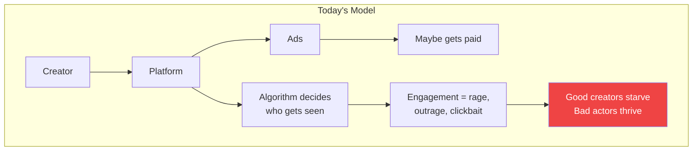
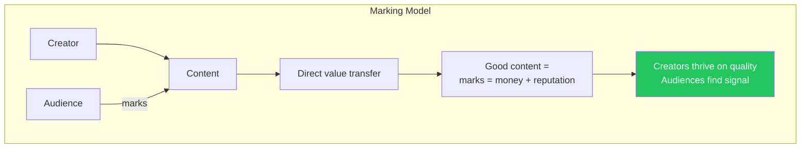
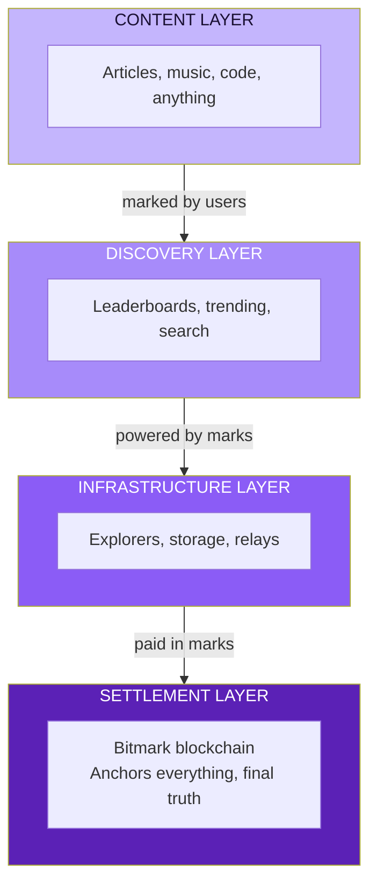
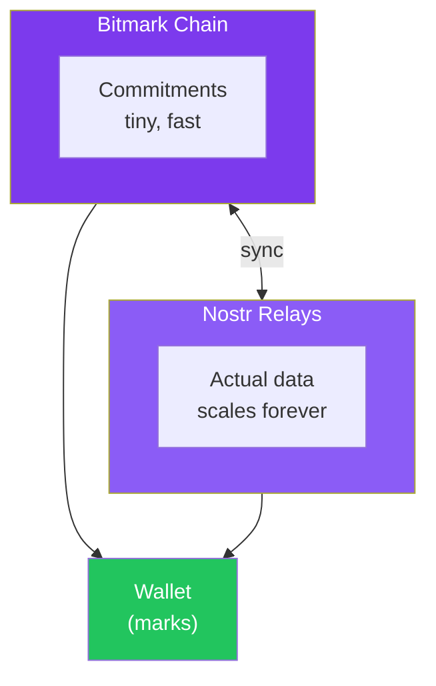
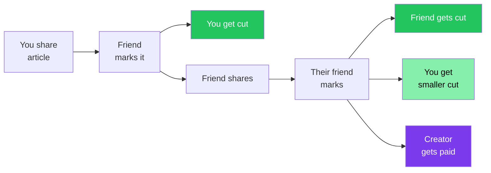

# The Marking Vision

## What if likes were worth something?

Every day, billions of people click "like" on content. That click means: *"This has value to me."*

But the value goes nowhere. It becomes a number on a screen. The creator gets nothing. The platform sells your attention to advertisers. You are the product.

**Marking changes everything.**

A mark is a like that carries real value. When you mark something, you transfer a small amount of actual currency to the creator. Not as charity. Not as tipping. As *earned reputation* that is also *money*.

One click. Real value flows. The web finally works the way it was supposed to.

---

## The Missing Primitive

Bitcoin answered: *"How do we transfer value without trust?"*

But it left a question unanswered: *"How do we transfer trust itself?"*

Think about it:
- Bitcoin is **stored energy** - Proof of Work converts electricity into scarcity
- What if there was **stored reputation** - Proof of Value converts helpfulness into currency?

**Bitmark is stored reputation.**

Every mark you receive is because you created something, shared something, helped someone. The marks you hold are crystallized evidence of value you've provided to others.

Bitcoin proved you can create money from energy. Bitmark proves you can create money from *being useful*.

---

## How Marking Works

It's simple:

1. You have marks (earned or purchased)
2. You see something valuable - an article, a song, a tool, a helpful answer
3. You mark it (one click, like a "like")
4. A small amount of marks transfers to the creator
5. Your reputation as a curator grows
6. Their reputation as a creator grows
7. Everyone watching sees the signal

Marks are divisible. You might give:
- **0.001 marks** for an amusing comment
- **0.01 marks** for a helpful article
- **1 mark** for something that changed your perspective
- **10 marks** for something that changed your life

The market decides what things are worth. No platform. No algorithm. Just people marking what they value.

---

## The Spam Problem Solves Itself

Current platforms fight spam with armies of moderators and AI filters. It's whack-a-mole. Spam is free to produce, expensive to fight.

With marking, **spam costs money**.



The economics flip:
- Quality content is profitable
- Spam is expensive
- No moderators needed
- The system self-regulates

---

## The Creator Economy, Fixed

Today's creator economy is broken:



With marking:



No middleman extracting value. No algorithm deciding your fate. Just earned reputation that pays the bills.

---

## Infrastructure as a Market

Every cryptocurrency has an infrastructure problem. Explorers, indexers, APIs, nodes - someone has to run them. Currently it's:
- Venture-funded companies (who will extract value later)
- Altruists (who burn out)
- The foundation (centralization)

**What if the infrastructure paid for itself through marking?**

### The Private Torrent Insight

Private torrent trackers solved a hard problem: how do you incentivize people to share files without free-riders killing the system?

Their answer: **ratio requirements**. Download 1GB, you need to upload 1GB. Contribute or get kicked.

This creates:
- Self-sustaining ecosystem
- Quality enforcement (good uploaders get ratio bonuses)
- Organic growth (healthy ratio = healthy community)
- No central funding needed

**Marking enables the same model for blockchain infrastructure.**

### How It Works

**Explorers** index the blockchain and serve queries:
```yaml
explorer:
  shards: [0, 150000]        # I index these blocks
  rate: 0.0001 marks/query   # This is my price
  free_tier: 100/day         # This builds my reputation
```

**Storage nodes** hold off-chain data (mark metadata, proofs, content hashes):
```yaml
storage:
  capacity: 500GB
  rate: 0.001 marks/MB
  retention: 1 year
  free_tier: 10MB/day
```

**Relays** route messages and sync state. They charge marks per message. Fast relays earn reputation.

Each operator:
- Sets their own rates
- Competes on reputation
- Gets paid for useful service
- No VC funding needed

---

## The Full Stack



Every layer pays the layer below it in marks. Every layer earns from the layer above it. Self-sustaining. Self-regulating. No extraction.

---

## Off-Chain Scaling with On-Chain Anchoring

The blockchain doesn't store content. It stores *commitments*.

**Blocktrails** - a technique for anchoring evolving state to the chain using key tweaking. Your marks, reputation, content hashes - they live on Nostr relays, IPFS, anywhere. The chain just proves the order and prevents double-spends.



This means:
- Chain stays small (phones can validate)
- Data scales infinitely (Nostr relays compete for storage marks)
- Censorship resistant (replicated everywhere)
- Fast (off-chain until settlement)

---

## The Web's Missing Payment Layer

HTTP status code **402: "Payment Required"**

Reserved since 1997. Never implemented. The web was supposed to have micropayments. It failed because:

- Payment fees were too high (can't pay $0.30 fee on $0.01 transaction)
- No reputation layer (who do you trust?)
- Centralized payment rails (gatekeepers extracted value)

**Marking is HTTP 402 realized.**

Payments so small they feel like likes. But they're real. They accumulate. They build reputation. They support creators. They fund infrastructure.

One click: content marked, creator paid, infra paid, sharer credited, reputation updated.

The value chain that should have existed from the beginning.

---

## Viral by Nature

Every mark is:
1. A payment to the creator
2. Reputation for the marker (good taste)
3. A signal to others (this is worth seeing)
4. A bookmark (you can find it again)
5. Potentially income (if you shared it and others mark through your link)

Sharing good content **pays you**. Not from ads. From the marks it receives.



Viral distribution where everyone in the chain earns. No platform extracting. Pure value flow.

---

## Charities and Public Goods

Marks are divisible to 5 decimal places. Tiny amounts can be automatically allocated:

```yaml
marking_config:
  charity_allocation: 0.25%    # Every mark, 0.25% to charity pool
  infrastructure_fee: 0.1%     # Pays for the network itself
  creator_share: 99.65%        # Vast majority to creator
```

Imagine 0.25% of all marks flowing to verified charities. No donation drives. No overhead. Just automatic, continuous funding proportional to network activity.

Public goods funded by public use.

---

## What This Enables

### For Creators
- Direct payment for good work
- Reputation that's portable (not locked in a platform)
- No algorithm gatekeeping your reach
- Sustainable income from quality, not clickbait

### For Consumers
- Signal in the noise (marks = quality indicator)
- Support creators with a click
- Build reputation as a curator
- Own your attention and data

### For Infrastructure Operators
- Revenue stream from useful service
- No VC funding needed
- Compete on quality, not capital
- Sustainable at cost + margin

### For the Web
- Micropayments finally work
- Spam economically unviable
- Quality content rises
- Value flows to creators, not platforms

---

## The Endgame

A web where:

- **Likes mean something** - Every mark is real value transferred
- **Creators thrive** - Direct relationship with audience, no middleman
- **Quality wins** - Good content profitable, spam expensive
- **Infrastructure sustains itself** - No altruism required, pure economics
- **Reputation is portable** - Your marks work everywhere
- **No gatekeepers** - Decentralized, open, permissionless

Not a platform. A protocol. Not a company. A network.

**The attention economy, rebuilt on earned value.**

---

## Current Status

The foundation exists:

- **Bitmark blockchain** - Running since 2014, multi-algo PoW, stable
- **Indexer + API** - Full blockchain queryable via REST
- **Explorer** - Web interface for the chain
- **Wallet** - BIP39/BIP32, transaction signing, send/receive

Next pieces:
- **Marking interface** - Mark URLs and content from the wallet
- **Nostr integration** - Off-chain data and reputation tracking
- **Blocktrails anchoring** - Efficient on-chain commitments
- **AMM routing** - Infrastructure marketplace

---

## Join the Build

This isn't a whitepaper for a future that might happen. The code exists. The chain runs. The wallet works.

What's needed:
- Developers who see the vision
- Creators who want a better deal
- Users tired of being the product
- Infrastructure operators who want sustainable revenue

The web is broken. Marking fixes it.

**One click. Real value. Earned reputation.**

---

> *"Consider marks to be spendable karma - an amusing post on a social network could pay for your coffee, marking a video of a crisis could pay for aid on the ground, marking an article about a mistreated animal could pay for its shelter."*
>
> *The principle of earned value is at the core of the Marking system.*
