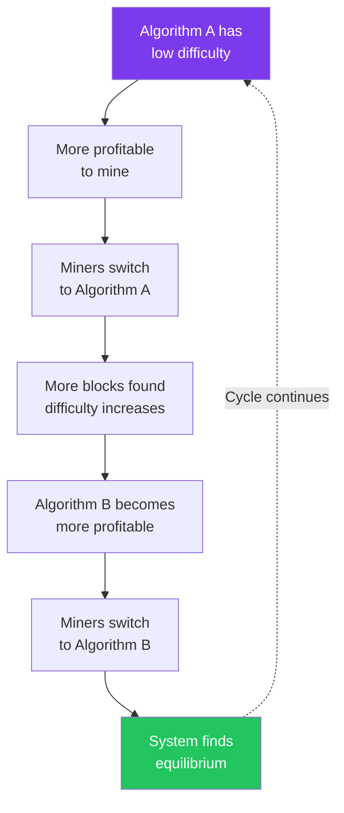

# Difficulty Adjustment

Bitmark uses **Dark Gravity Wave v3 (DGWv3)** for difficulty adjustment, customized for multi-algorithm operation.

## Overview

Each of the eight algorithms maintains **independent difficulty**, adjusted using a modified DGWv3 algorithm with special protections.

### Key Features

- **Per-Block Adjustment**: Difficulty adjusts every block for each algorithm
- **Algorithm Independence**: Each algorithm has separate difficulty
- **Quick Response**: Adapts rapidly to hashrate changes
- **Special Protections**: Surge Protector and Resurrector mechanisms

## Parameters

| Parameter | Value | Description |
|-----------|-------|-------------|
| DGW Timespan | 960 seconds | Target time for 25 blocks of same algo |
| Lookback Window | 25 blocks | Same-algorithm blocks considered |
| Target Per Algorithm | 16 minutes | Expected inter-block time per algo |
| Combined Target | 2 minutes | Expected time between any blocks |
| Min Adjustment | 1/3 | Maximum decrease per block |
| Max Adjustment | 3x | Maximum increase per block |

## Algorithm

### Basic DGWv3 Flow

```
1. Get last 25 blocks of the SAME algorithm
2. Calculate average difficulty of these blocks
3. Calculate actual timespan (first to last block)
4. Clamp timespan to [target/3, target*3]
5. Calculate new difficulty:
   new_diff = avg_diff × (target_time / actual_time)
6. Apply special rules (Surge Protector, Resurrector)
7. Ensure difficulty stays above minimum
```

### Implementation

```cpp
unsigned int GetNextWorkRequired(const CBlockIndex* pindexLast, int algo) {
    // Get last 25 blocks of this algorithm
    const CBlockIndex* pindexFirst = pindexLast;
    int blocksFound = 0;

    while (pindexFirst && blocksFound < 25) {
        if (pindexFirst->GetAlgo() == algo) {
            blocksFound++;
            if (blocksFound == 25) break;
        }
        pindexFirst = pindexFirst->pprev;
    }

    // Calculate timespan
    int64_t nActualTimespan = pindexLast->GetBlockTime() -
                              pindexFirst->GetBlockTime();

    // Clamp timespan
    int64_t nTargetTimespan = 25 * 960;  // 25 blocks × 16 min
    if (nActualTimespan < nTargetTimespan / 3)
        nActualTimespan = nTargetTimespan / 3;
    if (nActualTimespan > nTargetTimespan * 3)
        nActualTimespan = nTargetTimespan * 3;

    // Calculate new difficulty
    CBigNum bnNew = GetAverageDifficulty(pindexFirst, pindexLast, algo);
    bnNew *= nActualTimespan;
    bnNew /= nTargetTimespan;

    // Apply special rules...
    return bnNew.GetCompact();
}
```

## Surge Protector

Prevents a single algorithm from dominating the chain.

### Trigger Condition

Activates when **9 or more consecutive blocks** are from the same algorithm.

### Action

Divides difficulty by 3:

```cpp
if (lastInRow >= 9 && lastInRow % 9 == 0) {
    bnNew /= 3;  // Surge Protector activation
}
```

### Purpose

- Discourages burst mining
- Ensures fair distribution across algorithms
- Prevents algorithm dominance
- Maintains network diversity

### Example

```
Block 1000: Scrypt
Block 1001: Scrypt
...
Block 1008: Scrypt  (8 in a row - no action)
Block 1009: Scrypt  (9 in a row - difficulty ÷ 3)
```

After division, mining becomes less profitable for that algorithm, encouraging miners to switch.

## Resurrector

Keeps algorithms viable when mining activity drops.

### Trigger Condition

Activates when **no blocks from an algorithm** for over **160 minutes** (9600 seconds).

### Action

Reduces difficulty proportionally to the time elapsed:

```cpp
if (time_since_last_algo_block > 9600) {  // 160 minutes
    int64_t smultiplier = time_since_last_algo_block / 9600;
    nActualTimespan = 10 * smultiplier * nTargetTimespan;
    // This significantly reduces difficulty
}
```

### Purpose

- Prevents algorithm abandonment
- Ensures all algorithms remain mineable
- Revives "dead" algorithms automatically
- Maintains ecosystem diversity

### Example

```
Last Argon2d block: 3 hours ago (10,800 seconds)
Normal difficulty: Very high
Resurrector active: Difficulty significantly reduced
Result: Argon2d becomes profitable to mine again
```

## Difficulty Calculation Details

### Average Difficulty

The average difficulty is calculated across the lookback window:

```cpp
CBigNum GetAverageDifficulty(const CBlockIndex* first,
                             const CBlockIndex* last, int algo) {
    CBigNum sum = 0;
    int count = 0;

    for (const CBlockIndex* p = last; p != first; p = p->pprev) {
        if (p->GetAlgo() == algo) {
            sum += GetDifficulty(p);
            count++;
        }
    }

    return sum / count;
}
```

### Clamping

Timespan is clamped to prevent extreme adjustments:

```cpp
// Minimum: Can't adjust more than 3x easier
if (nActualTimespan < nTargetTimespan / 3)
    nActualTimespan = nTargetTimespan / 3;

// Maximum: Can't adjust more than 3x harder
if (nActualTimespan > nTargetTimespan * 3)
    nActualTimespan = nTargetTimespan * 3;
```

### Minimum Difficulty

Difficulty can never go below the proof-of-work limit:

```cpp
if (bnNew > bnProofOfWorkLimit)
    bnNew = bnProofOfWorkLimit;
```

## Visual Example

```
Algorithm: Argon2d
Target: 960 seconds (25 blocks)

Scenario: Fast mining (blocks coming every 30 seconds)
─────────────────────────────────────────────────────
Actual: 25 blocks in 750 seconds (too fast!)
Target: 25 blocks in 960 seconds

Adjustment:
  new_diff = old_diff × (960 / 750)
           = old_diff × 1.28

Result: 28% harder to mine

Scenario: Slow mining (blocks every 90 seconds)
─────────────────────────────────────────────────────
Actual: 25 blocks in 2250 seconds (too slow!)
Target: 25 blocks in 960 seconds

Adjustment:
  new_diff = old_diff × (960 / 2250)
           = old_diff × 0.43

Result: 57% easier to mine
```

## Interaction Between Algorithms

While each algorithm has independent difficulty, they interact through:

1. **Block selection**: Miners choose most profitable algorithm
2. **Profitability**: Difficulty changes affect profitability
3. **Natural balance**: Market forces balance algorithms



## Monitoring Difficulty

### RPC Commands

```bash
# Get current difficulty per algorithm
bitmark-cli getmininginfo

# Get difficulty for specific block
bitmark-cli getblock <blockhash>
```

### Block Explorer

View algorithm-specific difficulty charts at block explorers.

## Historical Context

### Before Fork (Block < 450,947)

- Single algorithm (Scrypt)
- Standard 720-block retargeting
- No special mechanisms

### After Fork (Block ≥ 450,947)

- Eight algorithms
- Per-block DGWv3
- Surge Protector
- Resurrector

## Comparison to Other Coins

| Feature | Bitcoin | Litecoin | Dash | Bitmark |
|---------|---------|----------|------|---------|
| Algorithms | 1 | 1 | 1 | 8 |
| Retarget | 2016 blocks | 2016 blocks | Every block | Every block |
| Method | Simple | Simple | DGWv3 | DGWv3+ |
| Special Rules | None | None | None | Surge/Resurrector |

## See Also

- [Multi-Algorithm PoW](/technical/multi-algo) - The eight algorithms
- [Emission Model](/technical/emission-model) - How rewards work
- [Mining Guide](/ecosystem/mining) - Practical mining setup
