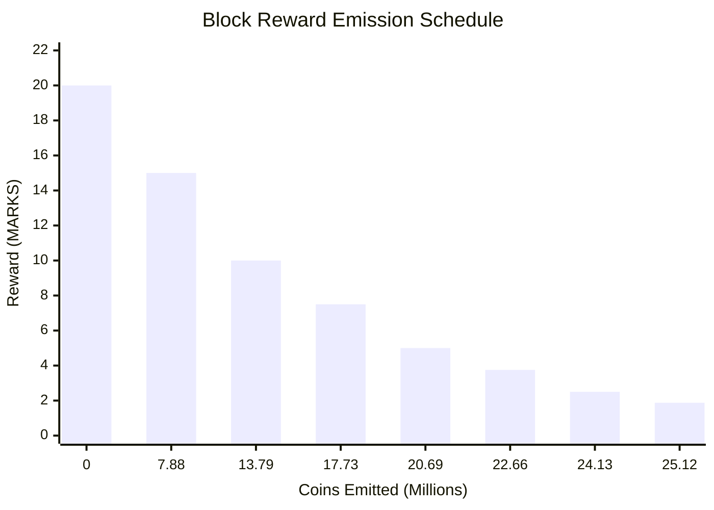

# Coin Emission Model

The Coin Emission Model (CEM) defines Bitmark's monetary policy, determining how new coins enter circulation.

## Overview

Bitmark uses an **emission-based** (not height-based) subsidy system with:

- Combined halving and quartering schedule
- Per-algorithm distribution (1/8 each)
- Dynamic Subsidy Scaling Factor (SSF)

## Maximum Supply

```
Total Maximum Emission: 27,579,894.73108 MARKS
                      = 2,757,989,473,108,000 satoshis
```

## Emission Schedule

### Reward Thresholds

Rewards are based on total coins emitted, not block height:

| Emitted (MARKS) | Base Subsidy | Note |
|-----------------|--------------|------|
| 0 - 7,880,000 | 20.0 | Q1 H0 |
| 7.88M - 13.79M | 15.0 | Q1 H1 |
| 13.79M - 17.73M | 10.0 | Q2 H1 |
| 17.73M - 20.685M | 7.5 | Q2 H2 |
| 20.685M - 22.655M | 5.0 | Q3 H2 |
| 22.655M - 24.1325M | 3.75 | Q3 H3 |
| 24.1325M - 25.1175M | 2.5 | Q4 H3 |
| 25.1175M - 25.85625M | 1.875 | Q4 H4 |
| ... | ... | Continues |

Where Q = Quartering period, H = Halving period

### Visual Representation



The emission follows a stairstep pattern with halvings and quarterings reducing the block reward over time.

## Per-Algorithm Distribution

Each of the 8 algorithms receives **1/8** of the emission:

```cpp
CAmount GetAlgorithmSubsidy(int algo, CAmount baseSubsidy) {
    return baseSubsidy / NUM_ALGOS;  // NUM_ALGOS = 8
}
```

### Example

At 20 MARKS base subsidy:
- Each algorithm rewards: 2.5 MARKS per block
- 8 algorithms × 90 blocks/day = 720 blocks/day
- Daily emission: ~1,800 MARKS (at initial rate)

## Subsidy Scaling Factor (SSF)

The SSF adjusts rewards based on network hashrate to maintain predictable emission.

### Purpose

- Prevents hashrate spikes from accelerating emission
- Maintains predictable monetary policy
- Smooths reward distribution

### Calculation

```cpp
scaled_subsidy = base_subsidy - (base_subsidy × 100,000,000 / scaling_factor) / 2
```

Or equivalently:
```cpp
scaled_subsidy = base_subsidy × (1 - 50,000,000 / scaling_factor)
```

### Update Frequency

- Updates approximately every **90 blocks per algorithm** (~24 hours)
- Blocks with `BLOCK_VERSION_UPDATE_SSF` flag trigger recalculation
- Factor remains constant between updates

### Implementation

```cpp
CAmount GetBlockValue(const CBlockIndex* pindex, CAmount nFees) {
    CAmount baseSubsidy = GetBaseSubsidy(pindex);

    if (!scalingFactor) {
        return nFees + baseSubsidy;  // No scaling
    }

    // Apply scaling
    CAmount scaled = baseSubsidy -
        ((CBigNum(baseSubsidy) * CBigNum(100000000)) / scalingFactor).getuint() / 2;

    return nFees + scaled;
}
```

### Effect Examples

| Scaling Factor | Effective Rate |
|----------------|----------------|
| ∞ (no scaling) | 100% |
| 400,000,000 | 87.5% |
| 200,000,000 | 75% |
| 100,000,000 | 50% |

## Emission vs Height

### Why Emission-Based?

Height-based thresholds assume predictable block times. With multiple algorithms:

- Block production rate varies
- Some algorithms may be faster/slower
- Total emission would be unpredictable

Emission-based thresholds ensure:
- Fixed maximum supply
- Predictable monetary policy
- Fair distribution regardless of algorithm popularity

### Calculation

```cpp
// Effective emitted for subsidy calculation
int64_t effectiveEmitted = NUM_ALGOS * previousAlgoMoneySupply;

// This multiplies by 8 because each algorithm contributes 1/8
```

## Distribution Timeline

| Percentage Emitted | Approximate Timeframe |
|--------------------|----------------------|
| 50% | ~6 years from genesis |
| 75% | ~12 years from genesis |
| 90% | ~20 years from genesis |
| 99% | ~35 years from genesis |

## Comparison to Bitcoin

| Aspect | Bitmark | Bitcoin |
|--------|---------|---------|
| Maximum Supply | ~27.58M | 21M |
| Halving Interval | ~3 years (788K blocks) | ~4 years (210K blocks) |
| Block Time | 2 minutes | 10 minutes |
| Additional Mechanism | Quartering, SSF | None |
| Algorithms | 8 | 1 |

## Code References

### Key Functions

| Function | File | Purpose |
|----------|------|---------|
| `GetBlockValue()` | main.cpp | Calculate block subsidy |
| `GetBaseSubsidy()` | main.cpp | Base subsidy from emission |
| `get_ssf()` | core.cpp | Get scaling factor |
| `get_mpow_ms_correction()` | core.cpp | Money supply correction |

### Emission Thresholds

```cpp
// In main.cpp
static const int64_t EMISSION_THRESHOLDS[] = {
    788000000000000LL,    // 7.88 trillion satoshis
    1379000000000000LL,   // 13.79T
    1773000000000000LL,   // 17.73T
    2068500000000000LL,   // 20.685T
    // ...
};

static const CAmount SUBSIDY_VALUES[] = {
    2000000000LL,  // 20 MARKS
    1500000000LL,  // 15 MARKS
    1000000000LL,  // 10 MARKS
    750000000LL,   // 7.5 MARKS
    // ...
};
```

## Block Reward Validation

Miners must claim exactly the correct subsidy:

```cpp
bool ConnectBlock(const CBlock& block, ...) {
    CAmount blockValueNeeded = GetBlockValue(pindex, nFees, false);

    if (block.vtx[0].GetValueOut() > blockValueNeeded) {
        return state.DoS(100,
            error("ConnectBlock(): coinbase pays too much"));
    }
    // Block is valid
}
```

## Economic Analysis

### Smooth Emission

The halving + quartering pattern creates smoother transitions:

```
Traditional Halving:
20 → 10 → 5 → 2.5  (50% drop each time)

Bitmark Pattern:
20 → 15 → 10 → 7.5 → 5 → 3.75  (25-33% drops)
```

This reduces:
- Market shock at halving events
- Miner revenue volatility
- Price speculation around events

### Long-Term Sustainability

The tail emission approaches but never reaches zero:

```
Final minimum subsidy: ~0.015258 MARKS
Timeline: After ~40+ years
Purpose: Perpetual, minimal inflation for security
```

## See Also

- [Technical Overview](/technical/overview) - Architecture overview
- [Multi-Algorithm PoW](/technical/multi-algo) - Algorithm distribution
- [BIP-102](/bips/bip-102) - Formal specification
