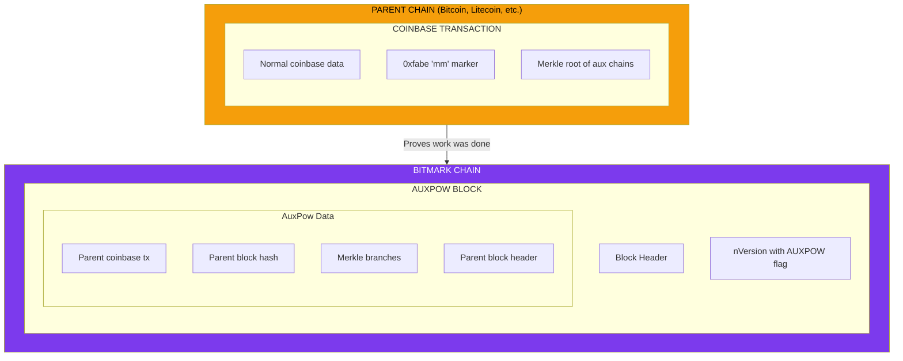

# Merge Mining

Bitmark supports **Auxiliary Proof-of-Work (AuxPow)**, enabling simultaneous mining with other compatible blockchains.

## Overview

Merge mining allows miners to use the same proof-of-work to secure multiple blockchains. A miner working on a "parent" chain (like Bitcoin or Litecoin) can simultaneously create valid blocks for Bitmark.

### Benefits

- **Increased Security**: Leverage parent chain's massive hashrate
- **Miner Efficiency**: Mine multiple coins with same hardware
- **No Extra Cost**: Parent chain mining continues normally
- **All Algorithms Supported**: Works with all 8 Bitmark algorithms

## How It Works



## AuxPow Structure

### Block Version Flag

AuxPow blocks are indicated by bit 8 in the version field:

```cpp
#define BLOCK_VERSION_AUXPOW (1 << 8)  // 0x100

// Check if block is AuxPow
bool IsAuxPow(int nVersion) {
    return nVersion & BLOCK_VERSION_AUXPOW;
}
```

### AuxPow Data

| Field | Description |
|-------|-------------|
| `coinbaseTx` | Parent chain coinbase transaction |
| `hashBlock` | Parent block hash |
| `vMerkleBranch` | Merkle branch linking coinbase to merkle root |
| `nIndex` | Index in merkle tree |
| `vChainMerkleBranch` | Chain merkle branch (for multiple aux chains) |
| `nChainIndex` | Chain index in auxiliary merkle tree |
| `parentBlock` | Complete parent block header |

### Chain ID

Bitmark uses a unique chain ID to prevent cross-chain confusion:

```cpp
// Chain ID for Bitmark
static const int AUXPOW_CHAIN_ID = 0x005B;  // 91 decimal

// Version includes chain ID
int nVersion = BLOCK_VERSION_AUXPOW |
               (AUXPOW_CHAIN_ID << 16) |
               (algo << 9) |
               baseVersion;
```

## Merge Mining Marker

The parent chain coinbase must contain the merge mining marker:

```
0xfa 'b' 'e' 'm' 'm'  (5 bytes: 0xfa62656d6d)
```

This marker indicates that the coinbase contains auxiliary chain commitments.

## Algorithm Compatibility

The parent chain must use the **same algorithm** as the Bitmark block being mined:

| Bitmark Algorithm | Compatible Parent Chains |
|-------------------|-------------------------|
| SCRYPT | Litecoin, Dogecoin, etc. |
| SHA256D | Bitcoin, Bitcoin Cash, etc. |
| YESCRYPT | Coins using Yescrypt |
| ARGON2D | Coins using Argon2d |
| X17 | Coins using X17 |
| LYRA2REv2 | Vertcoin, etc. |
| EQUIHASH | Zcash, etc. |
| CRYPTONIGHT | Monero (original), etc. |

## Validation

### AuxPow Block Validation

```cpp
bool CheckAuxPow(const CAuxPow& auxpow, int algo) {
    // 1. Verify merge mining marker exists
    if (!auxpow.HasMerkleBranch()) return false;

    // 2. Verify chain ID matches
    if (auxpow.GetChainId() != AUXPOW_CHAIN_ID) return false;

    // 3. Verify parent block meets difficulty
    uint256 parentHash = auxpow.parentBlock.GetPoWHash(algo);
    if (parentHash > auxpow.GetTarget()) return false;

    // 4. Verify merkle proofs
    if (!auxpow.VerifyMerkleBranch()) return false;

    // 5. Verify coinbase contains Bitmark header hash
    if (!auxpow.CheckMerkleBranch(hashAuxBlock)) return false;

    return true;
}
```

### Security Checks

1. **Chain ID**: Prevents using work from other merged coins
2. **Algorithm Match**: Parent must use same PoW algorithm
3. **Merkle Proof**: Coinbase must properly commit to aux block
4. **Difficulty**: Parent block must meet Bitmark's difficulty

## Mining Setup

### Pool Configuration

For mining pool operators:

```cpp
// In block template generation
if (isMergeMining) {
    // Include Bitmark header hash in coinbase
    std::vector<unsigned char> auxData;
    auxData.push_back(0xfa);
    auxData.push_back('b');
    auxData.push_back('e');
    auxData.push_back('m');
    auxData.push_back('m');
    auxData.insert(auxData.end(),
                   merkleRoot.begin(), merkleRoot.end());

    coinbase.append(auxData);
}
```

### Miner Configuration

For individual miners using compatible pools:

```bash
# Pool must support Bitmark merge mining
# No special miner configuration needed beyond
# connecting to a merge-mining pool
```

## RPC Support

### getauxblock

Request an auxiliary block template:

```bash
bitmark-cli getauxblock

# Response includes:
# - hash: The aux block hash to be solved
# - chainid: Bitmark's chain ID
# - target: Current difficulty target
```

### submitauxblock

Submit a solved auxiliary block:

```bash
bitmark-cli submitauxblock <hash> <auxpow>
```

## Example Version Numbers

| Description | nVersion (hex) | nVersion (decimal) |
|-------------|----------------|-------------------|
| Scrypt, no AuxPow | 0x00000004 | 4 |
| SHA256D, no AuxPow | 0x00000204 | 516 |
| Scrypt with AuxPow | 0x005B0104 | 5,963,012 |
| SHA256D with AuxPow | 0x005B0304 | 5,963,524 |
| LYRA2REv2 with AuxPow | 0x005B0B04 | 5,965,572 |
| Equihash with AuxPow | 0x005B0D04 | 5,966,084 |

## Security Considerations

### Parent Chain Trust

- Parent chain security doesn't directly affect Bitmark
- Only the work proof is used, not consensus rules
- Parent chain forks don't cause Bitmark forks

### Difficulty Independence

- Bitmark maintains independent difficulty
- Merge mining doesn't reduce security
- Actually increases security via additional hashrate

### Attack Resistance

Merge mining attack vectors:
1. **Parent 51%**: Doesn't help attack Bitmark
2. **Fake AuxPow**: Detected by merkle proof validation
3. **Wrong Algorithm**: Rejected by algorithm check

## Implementation Files

| File | Purpose |
|------|---------|
| `src/auxpow.h` | AuxPow structure definitions |
| `src/auxpow.cpp` | AuxPow validation |
| `src/core.cpp` | Block version handling |
| `src/rpcmining.cpp` | getauxblock RPC |

## History

- **Block 0**: Genesis, no AuxPow
- **Block 450,947**: mPoW fork, AuxPow enabled for all algorithms

## See Also

- [Multi-Algorithm PoW](/technical/multi-algo) - The eight algorithms
- [Mining Guide](/ecosystem/mining) - Practical mining setup
- [BIP-101](/bips/bip-101) - Fork specification
