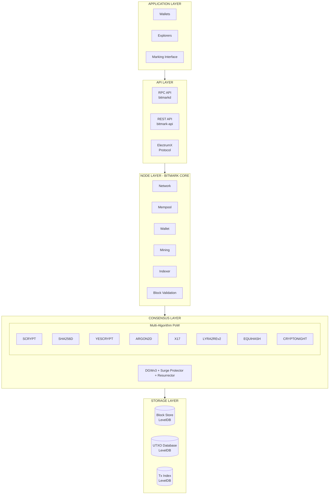

# Technical Overview

Bitmark is built on a Bitcoin-derived codebase with significant modifications for multi-algorithm proof-of-work and the Marking system.

## Architecture



## Core Specifications

### Network Parameters

| Parameter | Mainnet | Testnet |
|-----------|---------|---------|
| Default Port | 9265 | 19265 |
| RPC Port | 9266 | 19266 |
| Address Prefix | 85 (`b`) | 130 (`u`) |
| Message Magic | `0xf9beb4d9` | `0x0b110907` |
| Genesis Timestamp | July 13, 2014 | - |

### Block Parameters

| Parameter | Value |
|-----------|-------|
| Target Block Time | 120 seconds (2 minutes) |
| Per-Algorithm Target | 960 seconds (16 minutes) |
| Difficulty Window | 25 blocks (per algorithm) |
| Block Size Limit | 1 MB |
| Block Version | 4+ (post-fork) |

### Monetary Policy

| Parameter | Value |
|-----------|-------|
| Maximum Supply | ~27,579,894 MARKS |
| Initial Block Reward | 20 MARKS |
| Per-Algorithm Reward | 2.5 MARKS (20/8) |
| Smallest Unit | 1 satoshi (10⁻⁸ MARKS) |

## Consensus Rules

### Block Validity

A block is valid if:

1. **Header valid**: Correct hash, meets difficulty target
2. **Algorithm valid**: Hash matches declared algorithm
3. **Timestamp valid**: Within 2 hours of network time
4. **Transactions valid**: All transactions pass validation
5. **Merkle root valid**: Matches computed root
6. **Size valid**: Under block size limit
7. **Subsidy valid**: Coinbase claims correct reward

### Transaction Validity

A transaction is valid if:

1. **Inputs exist**: All referenced UTXOs exist
2. **Not double-spend**: UTXOs not already spent
3. **Scripts valid**: All input scripts execute successfully
4. **Amount valid**: Inputs ≥ Outputs
5. **Size valid**: Under transaction size limit

## Key Components

### Block Header

Standard (non-Equihash):
```
┌────────────────────────────────────────────────────────────┐
│ nVersion (4)│hashPrevBlock(32)│hashMerkle(32)│nTime(4)    │
├────────────────────────────────────────────────────────────┤
│ nBits (4)   │ nNonce (4)                                   │
└────────────────────────────────────────────────────────────┘
Total: 80 bytes
```

Equihash:
```
┌────────────────────────────────────────────────────────────┐
│ nVersion(4)│hashPrevBlock(32)│hashMerkle(32)│hashReserved(32)
├────────────────────────────────────────────────────────────┤
│ nTime(4)   │ nBits(4)       │ nNonce256(32) │ nSolution(var)
└────────────────────────────────────────────────────────────┘
```

### Version Field Encoding

```
Bits 0-7:   Standard version number (≥4 for fork)
Bit 8:      AUXPOW flag (merged mining)
Bits 9-11:  Algorithm selector (0-7)
Bit 12:     UPDATE_SSF flag (scaling factor)
Bits 16+:   Chain ID (for AuxPow)
```

### Transaction Structure

```
┌─────────────────────────────────────────────────────────────┐
│ Version (4 bytes)                                           │
├─────────────────────────────────────────────────────────────┤
│ Input Count (varint)                                        │
├─────────────────────────────────────────────────────────────┤
│ Inputs:                                                     │
│   - Previous Tx Hash (32 bytes)                             │
│   - Previous Output Index (4 bytes)                         │
│   - Script Length (varint)                                  │
│   - Script Sig (variable)                                   │
│   - Sequence (4 bytes)                                      │
├─────────────────────────────────────────────────────────────┤
│ Output Count (varint)                                       │
├─────────────────────────────────────────────────────────────┤
│ Outputs:                                                    │
│   - Value (8 bytes)                                         │
│   - Script Length (varint)                                  │
│   - Script PubKey (variable)                                │
├─────────────────────────────────────────────────────────────┤
│ Lock Time (4 bytes)                                         │
└─────────────────────────────────────────────────────────────┘
```

## Source Code Organization

```
bitmark/
├── src/
│   ├── ar2/           # Argon2 implementation
│   ├── consensus/     # Consensus rules
│   ├── crypto/        # Cryptographic functions
│   ├── cryptonight/   # CryptoNight implementation
│   ├── Lyra2RE/       # Lyra2REv2 implementation
│   ├── net/           # P2P networking
│   ├── policy/        # Policy defaults
│   ├── primitives/    # Block, transaction structures
│   ├── qt/            # GUI wallet
│   ├── rpc/           # RPC interface
│   ├── script/        # Script interpreter
│   ├── wallet/        # Wallet functionality
│   ├── yescrypt/      # Yescrypt implementation
│   ├── chainparams.cpp  # Network parameters
│   ├── core.cpp       # Core functions
│   ├── main.cpp       # Main logic, consensus
│   ├── pureheader.h   # Algorithm definitions
│   └── scrypt.cpp     # Scrypt implementation
├── doc/               # Documentation
├── share/             # Build resources
└── contrib/           # Utilities
```

## Key Files Reference

| File | Purpose |
|------|---------|
| `src/chainparams.cpp` | Network and genesis parameters |
| `src/main.cpp` | Consensus rules, block validation |
| `src/pureheader.h` | Algorithm definitions, version flags |
| `src/core.cpp` | Block/transaction helpers |
| `src/rpcmining.cpp` | Mining RPC commands |
| `src/scrypt.cpp` | Scrypt PoW function |

## Differences from Bitcoin

| Feature | Bitcoin | Bitmark |
|---------|---------|---------|
| Block Time | 10 minutes | 2 minutes |
| Algorithms | SHA256D only | 8 algorithms |
| Difficulty | Every 2016 blocks | Every block (DGWv3) |
| Max Supply | 21 million | ~27.58 million |
| Emission | Halving only | Halving + Quartering |
| Merge Mining | No | Yes (all algorithms) |
| Special Tx | None | MRK marks |

## See Also

- [Multi-Algorithm PoW](/technical/multi-algo) - Deep dive into the 8 algorithms
- [Difficulty Adjustment](/technical/difficulty-adjustment) - DGWv3 details
- [Emission Model](/technical/emission-model) - Monetary policy details
- [Network Parameters](/technical/network-parameters) - Complete parameter reference
